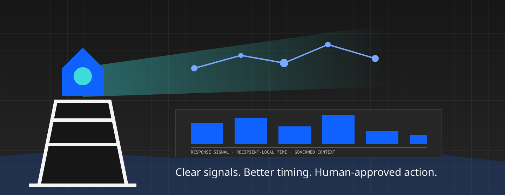
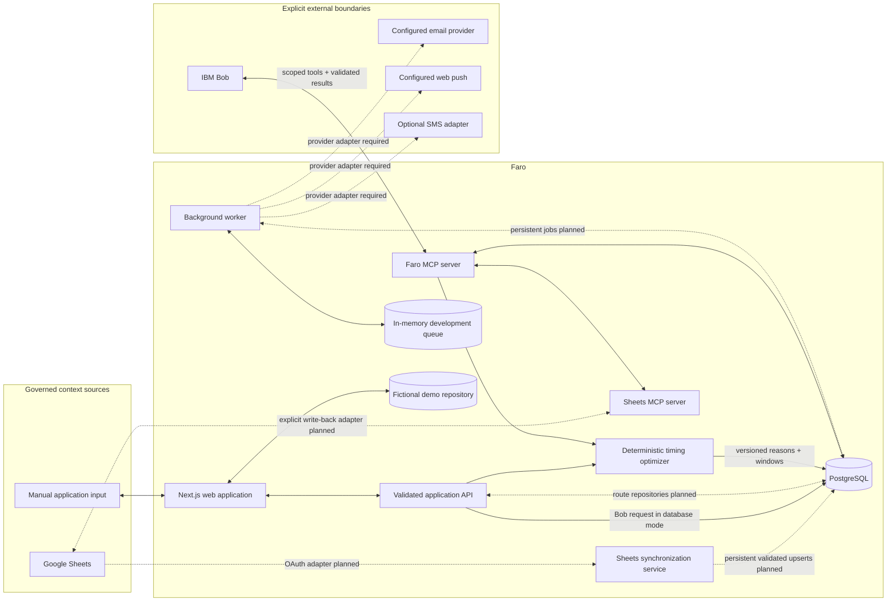
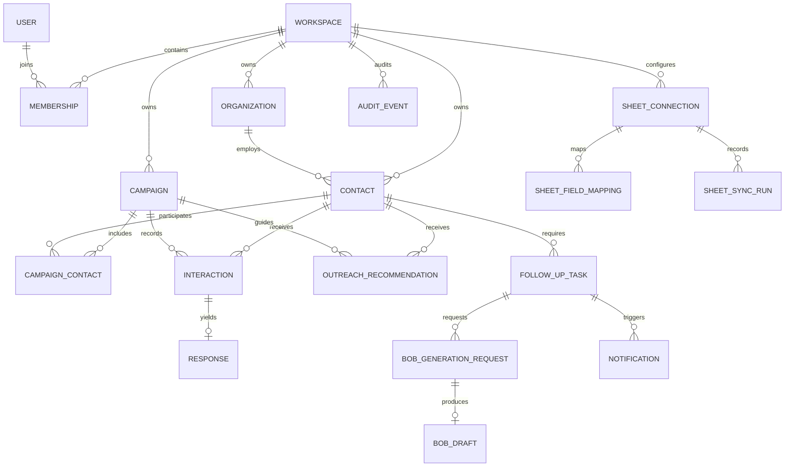

# Faro

<p align="center">
  
</p>

<p align="center"><strong>Turn outreach activity into clear signals, better timing, and more meaningful responses.</strong></p>

Faro is an outreach and sponsorship intelligence platform for partnership, program, fundraising,
and community-engagement teams. It organizes contacts and campaigns, calculates auditable outreach
windows, prioritizes follow-up work, previews governed spreadsheet data, and routes tailored draft
requests through IBM Bob—always with visible provenance and human approval.

The name comes from the Spanish word _faro_, “lighthouse.” The product is designed as a calm control
center: enough context to navigate the next decision without burying the team in activity noise.

Faro was created as a hackathon project to demonstrate that useful AI-assisted outreach needs more
than text generation. It combines governed data, explainable timing, IBM Bob drafting, validation,
and human approval in one end-to-end workflow. See the
[hackathon story and real-world applications](docs/HACKATHON_AND_USE_CASES.md).



> Faro uses Carbon and an IBM-inspired visual language. It is not an official IBM product and does
> not use the IBM corporate logo.

## Product capabilities

- **Signal overview:** response, positive-response, follow-up, timing, value, sync, and draft health.
- **Relationship context:** participants, sponsors, partners, organizations, campaigns, consent,
  interactions, response proposals, recommendations, tasks, drafts, and audit history.
- **Explainable timing:** deterministic, timezone/DST-aware recommendations with alternatives,
  confidence, data sufficiency, reason codes, warnings, and reproducibility fingerprints.
- **Actionable follow-ups:** one prioritized queue for overdue work, due-today work, pending Bob
  requests, editable drafts, snoozes, approvals, and completion.
- **Governed Sheets preview foundation:** shared typed client, arbitrary mappings, row validation,
  deduplication, explicit conflict behavior, pagination/checkpoint primitives, and formula protection.
- **IBM Bob-only drafting:** versioned prompts, minimized source context, injection defenses,
  validated output, MCP tools, provenance, risk flags, and mandatory review.
- **Truthful notification adapters:** in-app and development previews without claiming an email,
  push, or SMS was delivered.
- **Sponsorship intelligence:** configurable pipeline stages, estimated and weighted value,
  decision-maker coverage, campaign comparison, and follow-up health.

## Real-world applications

Faro's original scenario is hackathon sponsorship: import a sponsor pipeline, identify the next
relationship action, use IBM Bob to prepare a grounded draft, and keep the organizer in control of
what is sent. The same governed workflow applies to nonprofit fundraising, university and community
partnerships, business development, customer success, and other relationship-driven teams.

In each case, Faro is the control and evidence layer—not an autonomous sender. It scopes the facts,
enforces consent and suppression, calculates timing, validates Bob's structured result, records
provenance, and requires a person to review the message. The detailed scenarios and a suggested
hackathon demo flow are in [Hackathon story and real-world applications](docs/HACKATHON_AND_USE_CASES.md).

## Interface

The screenshots below are captured from the running seeded application with Playwright. They show
implemented UI; no screen was manufactured for a planned feature.

### Signal dashboard


### Human-approved follow-up workflow


<details>
<summary>Analytics and Google Sheets preview</summary>


</details>

## Architecture

Faro is a pnpm/TypeScript workspace. PostgreSQL is the canonical operational store. The web app can
also run against a clearly labeled, fictional demo repository so the product tour needs no external
credentials. Integration boundaries live in packages and are testable outside Next.js. Dashed
arrows below identify production adapters that are designed but not yet shipped.



### Outreach and follow-up sequence

```mermaid
sequenceDiagram
  autonumber
  actor User
  participant Sheet as Google Sheets
  participant Sync as Faro sync service
  participant DB as PostgreSQL
  participant Opt as Timing optimizer
  participant Worker
  participant Web as Faro web
  participant MCP as Faro MCP
  participant Bob as IBM Bob
  participant Delivery as Approved delivery/manual copy

  Sheet->>Sync: Read governed rows and checkpoint (production adapter planned)
  Sync->>Sync: Map, validate, deduplicate, preview
  Sync-->>DB: Idempotent approved upserts + audit (planned)
  DB->>Opt: Contact, campaign, history, policies
  Opt->>DB: Reproducible recommendation + reasons
  Worker-->>DB: Find follow-up becoming due (persistent adapter planned)
  Worker->>Web: Internal reminder / development preview
  User->>Web: Request IBM Bob draft
  Web->>DB: Versioned generation request (AWAITING_BOB)
  Bob->>MCP: Claim request
  MCP->>DB: Authorize workspace and approved sources
  Bob->>MCP: Read minimized contact/campaign/history context
  Bob->>MCP: Save structured draft
  MCP->>DB: Validate, persist, audit; never send
  Web-->>User: Draft ready with provenance and risks
  User->>Web: Review and edit
  User->>Web: Approve
  Web->>DB: Approval audit
  User->>Delivery: Explicit send action or manual copy
  Delivery->>DB: Delivery/response ingestion when configured
  DB-->>Web: Updated response and analytics signals
```

### Canonical data model



See [architecture decisions](docs/architecture/DECISIONS.md),
[AI boundary](docs/AI_BOUNDARY.md), and [security notes](docs/SECURITY.md).

## Technology stack

| Layer          | Technology                                                                           |
| -------------- | ------------------------------------------------------------------------------------ |
| Web            | Next.js App Router, React, strict TypeScript                                         |
| Design         | Carbon React, Carbon icons, Carbon Charts, IBM Plex Sans/Mono                        |
| Data           | PostgreSQL 17, Prisma 6                                                              |
| Jobs           | In-memory development repository; PostgreSQL/Redis adapters are planned              |
| Validation     | Zod at application, provider, sync, and MCP boundaries                               |
| IBM Bob        | Versioned prompt contracts and first-party Faro MCP server                           |
| Sheets         | Shared typed client, fixture adapter, sync primitives, first-party Sheets MCP server |
| Tests          | Vitest, Playwright, axe accessibility smoke checks                                   |
| Local services | Docker Compose for PostgreSQL and Redis                                              |
| CI             | GitHub Actions: format, lint, typecheck, unit/integration, build, database, E2E      |

## Repository layout

```text
apps/
  web/                    Next.js product UI and validated route handlers
  worker/                 Follow-up/notification development job runner
packages/
  core/                   Domain contracts, workspace guards, demo repository
  database/               Prisma schema, migration, client, fictional seed
  optimizer/              Deterministic outreach-window scoring
  ibm-bob/                Only permitted AI boundary
  faro-mcp/               Governed IBM Bob/Faro MCP tools
  google-sheets/          Shared client, mapping, preview, sync, write protection
  google-sheets-mcp/      Scoped Sheets MCP tools
  notifications/          Provider contracts, scheduling, dedupe, preview adapter
docs/                     Assets, screenshots, architecture and integration guidance
scripts/                  Boundary checks and screenshot capture
tests/                    Cross-package integration and browser flows
```

`PLAN.md` records the repository assessment, decisions, milestones, risks, and verification plan.
`AGENTS.md` is the durable engineering guide for contributors and coding agents.

## Local quick start

Prerequisites: Node.js 22+, pnpm 10+, and Docker for database mode.

### Credential-free product tour

```bash
corepack enable
pnpm install
cp .env.example .env
pnpm dev
```

`FARO_DATA_SOURCE=demo` is the default. Open <http://localhost:3000/dashboard>. The records are
fictional and all external integrations remain accurately disabled or preview-only.

### PostgreSQL-backed development

Put `DATABASE_URL` and the other local values in the repository-root `.env`, then run these commands
from the repository root:

```bash
docker compose up -d postgres redis
docker compose ps
pnpm db:generate
pnpm db:deploy
pnpm dev
```

Wait until `docker compose ps` reports PostgreSQL and Redis as `healthy` before deploying migrations.
Open <http://localhost:3000>; use that same hostname throughout Google OAuth rather than switching
between `localhost`, `127.0.0.1`, and the machine's network IP. Run `pnpm worker` in a second terminal
only when automatic Google Sheet polling is configured.

The checked-in migrations—not `prisma db push`—are the production migration contract. Running
`pnpm db:seed` is optional and adds fictional data; do not run it when you want a clean connected
tester workspace.

### Everyday server startup

After initial installation and migration, start Faro with:

```bash
docker compose up -d postgres redis
docker compose ps
pnpm dev
```

Stop the web server with `Ctrl+C`. Stop the local services when finished with:

```bash
docker compose stop
```

### `DATABASE_URL` missing during Prisma commands

Faro keeps its local `.env` at the repository root, but pnpm launches Prisma from
`packages/database`. The Prisma configuration explicitly loads the root `.env` so commands such as
`pnpm db:deploy` can see `DATABASE_URL`. If the command still reports `P1012` and
`Environment variable not found: DATABASE_URL`:

1. Confirm `.env` exists at the repository root, not only `.env.example`.
2. Confirm it contains a non-empty `DATABASE_URL` matching `compose.yaml`.
3. Run the command from the repository root.
4. Confirm PostgreSQL is healthy with `docker compose ps`.

Do not copy secrets into `packages/database` or commit `.env`.

## Environment variables

Copy `.env.example`; never commit `.env`.

| Variable                                     | Required             | Purpose / current behavior                                                                                                     |
| -------------------------------------------- | -------------------- | ------------------------------------------------------------------------------------------------------------------------------ |
| `DATABASE_URL`                               | Database mode        | PostgreSQL connection string. Local default matches Compose.                                                                   |
| `FARO_DATA_SOURCE`                           | No                   | `demo` by default; `database` selects persistence adapters as they are wired.                                                  |
| `FARO_DEMO_WORKSPACE_ID`                     | Demo                 | Pins the fictional workspace (`ws-beacon-lab`).                                                                                |
| `FARO_ENABLE_UNAUTHENTICATED_DEMO_DB_ACCESS` | Local database demo  | Explicitly unlocks fictional seed routes before production auth exists; never enable in a deployment.                          |
| `AUTH_SECRET`                                | Deployment           | Placeholder for secure session signing. Demo identity is not production auth.                                                  |
| `APP_URL`                                    | Deployment           | Canonical application URL.                                                                                                     |
| `REDIS_URL`                                  | Future adapter       | Reserved Redis endpoint; the shipped worker is in-memory only.                                                                 |
| `GOOGLE_CLIENT_ID`                           | Google OAuth         | Disabled until supplied and verified with the other Google variables.                                                          |
| `GOOGLE_CLIENT_SECRET`                       | Google OAuth         | Secret; never expose to IBM Bob or MCP results.                                                                                |
| `GOOGLE_REDIRECT_URI`                        | Google OAuth         | Exact validated callback URL.                                                                                                  |
| `TOKEN_ENCRYPTION_KEY`                       | Google OAuth         | Managed encryption key for stored provider tokens.                                                                             |
| `FARO_TESTER_EMAILS`                         | Deployment           | Comma-separated Google identities allowed into connected tester workspaces.                                                    |
| `FARO_SYNC_CRON_SECRET`                      | Deployment           | Bearer secret protecting the scheduled Google Sheet refresh endpoint.                                                          |
| `FARO_WEB_URL`                               | Worker               | Faro web origin used by the Sheet polling worker, such as `http://localhost:3000`.                                             |
| `FARO_SHEET_POLL_INTERVAL_MS`                | Worker               | Near-real-time polling interval; Faro enforces a minimum of 15 seconds.                                                        |
| `FARO_MCP_TOKEN`                             | MCP process          | Non-placeholder launch-time scope gate; keep in a secret manager.                                                              |
| `FARO_WORKSPACE_ID`                          | MCP process          | Pins one stdio process to one workspace.                                                                                       |
| `BOB_RUNTIME_ADAPTER`                        | No                   | Defaults to `unavailable` for the MCP-first flow; set to `bob-shell` only for the installed, verified local Bob Shell adapter. |
| `BOBSHELL_API_KEY`                           | Bob Shell automation | IBM Bob Inference API key used only when `BOB_RUNTIME_ADAPTER=bob-shell`; keep it in `.env` or deployment secret storage.      |
| `NOTIFICATION_ADAPTER`                       | No                   | `preview`; never reports external delivery.                                                                                    |

## Database, migrations, and seed

```bash
pnpm db:generate            # generate Prisma client
pnpm db:validate            # validate schema
pnpm db:migrate             # create/apply a development migration
pnpm db:deploy              # apply checked-in migrations
pnpm db:seed                # idempotent fictional seed
```

The schema covers workspace/user/membership, contacts/organizations, campaigns, interactions and
human-reviewed responses, optimizer records/outcomes, follow-ups, Bob request/draft lifecycle,
notifications, configurable pipeline stages, Sheets mapping/runs, and audit events.
Tenant-owned relations use workspace-aware indexes and composite constraints. The seed is safe to
run repeatedly and labels both static drafts `DEMO_DRAFT` with no provider operation ID.

## Google Sheets setup

For the combined contacts, follow-ups, Gmail history, and IBM Bob drafting workflow, follow the
page-by-page [Gmail outreach and IBM Bob setup guide](docs/EMAIL_OUTREACH_AND_BOB.md).

The local fixture path is ready now:

1. Open `/integrations/google-sheets`.
2. Review the seven inferred mappings.
3. Select **Preview and validate**.
4. Inspect two creates, one existing-contact update, and one invalid email.
5. Keep **Dry run** selected and review the idempotent preview result.

Live OAuth still requires the client/secret/redirect/encryption variables and a production token
repository. Until then the connection button is disabled, and Faro makes no Google API call or live
sync claim. See [Google Sheets synchronization](docs/GOOGLE_SHEETS.md).

## IBM Bob creation and integration

Faro creates IBM Bob work through a governed lifecycle rather than calling a generic model API.
Every request contains a versioned prompt, approved source IDs, workspace scope, and an idempotency
key. There are two supported execution paths:

### MCP-first workflow

1. The web flow validates context and creates an `AWAITING_BOB` generation request.
2. Copy `.bob/mcp.example.json` to ignored `.bob/mcp.json` and update the absolute path/secrets.
3. Start `pnpm mcp:faro` for Faro tools and optionally `pnpm mcp:sheets` for governed sheet tools.
4. In database mode, Bob claims a persisted request, retrieves only approved workspace context,
   and saves validated structured output.
5. A user edits and approves the result in Faro. No tool sends external outreach.

### Optional local Bob Shell automation

When IBM Bob Shell is installed and an IBM Bob Inference key is available, set
`BOB_RUNTIME_ADAPTER=bob-shell` and `BOBSHELL_API_KEY` in the ignored `.env`. The web route invokes
the local `bob` process, accepts only the required JSON shape, validates it through the same IBM Bob
boundary, and saves it with IBM Bob provenance. Missing credentials, timeouts, command failures, or
invalid output move the request to `FAILED`; they never produce a fabricated draft or a send action.

The default remains `unavailable`, which keeps requests pending for MCP processing. This is useful
for reviewers who do not have Bob Shell and avoids inventing an undocumented HTTP model endpoint.

The default stdio launcher is explicit about whether a shared persistence backend is configured.
The launch token is a process-presence/scope gate, not per-call bearer authentication; production
deployment must bind an expiring principal and permissions at the process/transport boundary.

Read the complete [IBM Bob workflow](docs/IBM_BOB_WORKFLOW.md).

For Google Console links, secret generation, tester login, and deployment preflight, read
[tester deployment and integration setup](docs/DEPLOYMENT_INTEGRATIONS.md).

Connected campaign membership and real database-derived metrics are documented in
[campaign associations and analytics](docs/CAMPAIGN_ANALYTICS.md).

### IBM Bob-only AI policy

IBM Bob is the only runtime AI integration allowed in Faro. There is no OpenAI, Anthropic, Gemini,
generic model router, or silent fallback. Codex is used only to develop the repository. Runtime
source is checked with `pnpm check:ai-boundary`.

Only authenticated Bob results may display **Generated by IBM Bob**. Static examples display
**Demo draft**. Pending requests display **Awaiting IBM Bob**. Imported rows and inbound message
bodies are untrusted context, not instructions. See [AI boundary](docs/AI_BOUNDARY.md).

## Notification providers

The implemented `PreviewNotificationAdapter` records in-app/email/push/SMS-shaped previews as
`PREVIEWED` and states that no external provider was called. Scheduling is timezone and quiet-hour
aware; dispatch uses workspace-scoped deduplication and audit events.

Email, service-worker push, and SMS need separately configured and verified provider adapters. No
vendor is hard-coded. External contact outreach remains separate from internal reminders and
requires review. See [notifications](docs/NOTIFICATIONS.md).

## Testing and verification

```bash
pnpm format:check           # repository formatting
pnpm lint                   # strict ESLint, zero warnings
pnpm typecheck              # every workspace package
pnpm test                   # optimizer, isolation, Bob, Sheets, MCP, notifications, worker
pnpm test:integration       # cross-package governed lifecycle
pnpm test:database          # PostgreSQL Bob request/MCP persistence lifecycle
pnpm check:ai-boundary      # runtime provider policy
pnpm build                  # production builds for apps and packages
pnpm exec playwright install chromium
pnpm test:e2e               # Chromium + mobile critical flows and axe smoke tests
```

Browser flows cover the seeded dashboard, fixture sheet preview/dry run, contact recommendation,
pending Bob request, editable demo-draft approval, and accessibility smoke checks. Capture new real
screenshots with a running app:

```bash
pnpm tsx scripts/capture-screenshots.ts
```

## Security and privacy

- Server-side workspace scope and role checks protect tenant-owned repository and MCP operations.
- Consent and suppression are hard stops before timing or drafting.
- Zod validates untrusted input and Bob output; approved source IDs constrain citations.
- Google tokens are never stored in repository files or returned to Bob.
- Formula-injection protection guards explicit sheet write-back.
- Generation, sync, notification, and job operations use idempotency/deduplication contracts.
- Sensitive route rate limiting is process-local for development and must become distributed in
  production.
- The demo identity is not secure session handling. Production deployment must add an identity
  provider, HTTP-only same-site sessions, CSRF protection, scoped MCP credentials, managed token
  encryption, webhook verification, retention workflows, and operational monitoring.

See [security and privacy](docs/SECURITY.md). If a local plaintext credential has ever been exposed,
rotate it; `.gitignore` does not revoke a secret.

## Accessibility

The product uses semantic landmarks, a skip link, keyboard-operable queues and controls, visible
focus, text-plus-icon status, table captions, chart summaries, responsive reflow, forced-color
considerations, and reduced-motion rules. Playwright runs axe critical-violation smoke checks on the
dashboard and follow-up center. Manual screen-reader, zoom, contrast, and mobile reviews are still
release requirements. See [accessibility notes](docs/ACCESSIBILITY.md).

## Implementation status

| Capability                                            | Status                                        | Notes                                                                                                     |
| ----------------------------------------------------- | --------------------------------------------- | --------------------------------------------------------------------------------------------------------- |
| Carbon app shell and responsive product routes        | **Implemented**                               | Light/dark themes, seeded dashboard, contacts, orgs, campaigns, follow-ups, analytics, settings.          |
| PostgreSQL schema, migration, and seed                | **Implemented**                               | Canonical model and idempotent fictional data verified locally.                                           |
| Workspace guards and demo repository                  | **Implemented**                               | Tested isolation; demo identity is not production authentication.                                         |
| Outreach-window optimizer                             | **Implemented**                               | Deterministic, DST/quiet-hour/suppression/frequency aware, versioned, tested.                             |
| Bob contracts, prompts, validation, request lifecycle | **Implemented**                               | No external send; in-memory and persistence adapter paths are explicit.                                   |
| Faro MCP Bob tools                                    | **Implemented**                               | Typed, scoped, minimized and audited; PostgreSQL lifecycle is shared with the web route in database mode. |
| Sheets MCP tools                                      | **Development adapter**                       | Typed, scoped dry-run preview only; no live connection or canonical write path is claimed.                |
| Sheet mapping/preview/dedup/formula protection        | **Implemented**                               | Fixture path verified; PostgreSQL remains canonical.                                                      |
| Live Google OAuth                                     | **Credentials + production adapter required** | UI is accurately disabled.                                                                                |
| IBM Bob MCP workflow                                  | **Implemented**                               | Pending requests, scoped context reads, validated writes, and audit events; no fallback provider.         |
| Local IBM Bob Shell runtime                           | **Opt-in adapter**                            | Runs only when installed and explicitly configured; validated drafts still require human review.          |
| Notification delivery                                 | **Development adapter**                       | In-app/preview only; no email/push/SMS delivery claim.                                                    |
| Production authentication and distributed rate limit  | **Planned**                                   | Boundaries exist; deployment implementation required.                                                     |
| Automated external outreach                           | **Not implemented by design**                 | Human review is the default safety policy.                                                                |

## Roadmap

1. Production identity/session integration and database-backed route repositories.
2. Google OAuth with managed token encryption, incremental scheduler, and operational retry UI.
3. Production MCP transport identity, scoped expiring principals, and audit observability.
4. Verified email and web-push reminder providers with signed event ingestion.
5. Response ingestion, human correction-quality dashboards, export/deletion UI, and retention jobs.
6. Recommendation outcome experiments that compare accepted/edited/dismissed timing against replies.

## Contributing

Read `AGENTS.md` and `PLAN.md` first. Keep changes workspace-scoped, validated, auditable, responsive,
and truthful about provider behavior. Add tests for safety boundaries and update the status table when
capabilities move between implemented, development adapter, credentials required, and planned.

Before opening a pull request:

```bash
pnpm format
pnpm lint
pnpm typecheck
pnpm test
pnpm test:integration
pnpm check:ai-boundary
pnpm build
pnpm test:e2e --project=chromium
```

Never add another AI provider, commit personal data or secrets, auto-send a Bob draft, weaken
workspace isolation, or relabel development previews as real delivery.

## License

Faro is available under the [MIT License](LICENSE). Carbon packages and IBM Plex fonts retain their
respective upstream licenses. “IBM” and “IBM Bob” are trademarks of their respective owner; this
project does not imply affiliation or endorsement.
