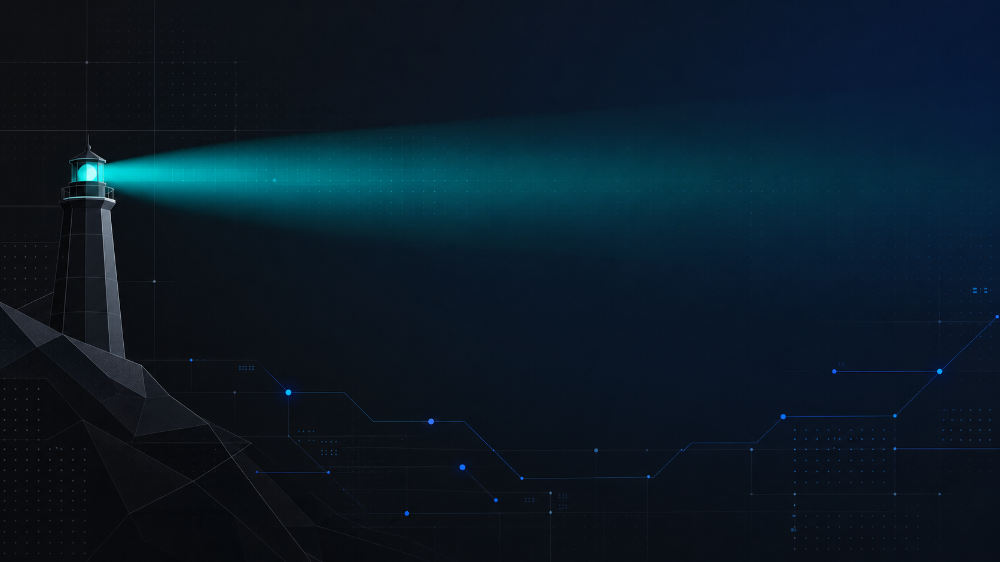
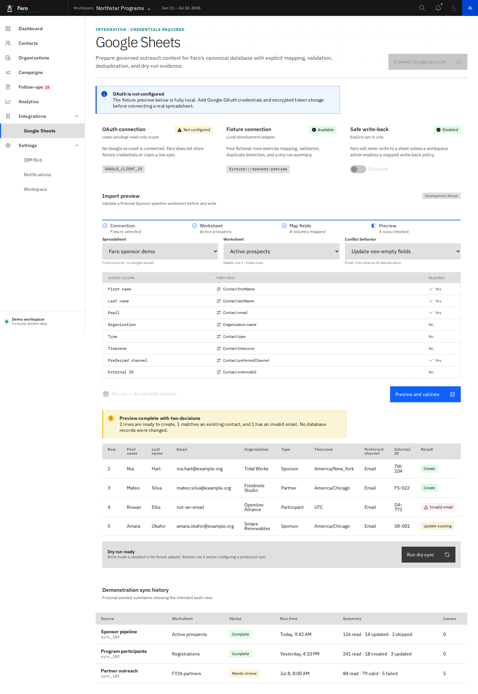
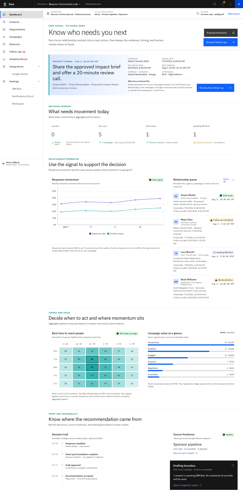
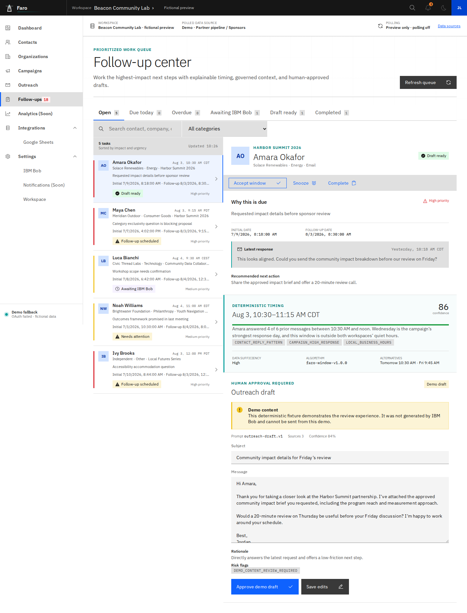
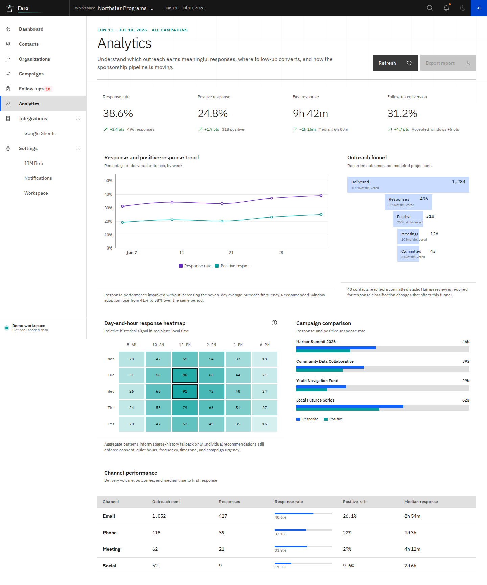
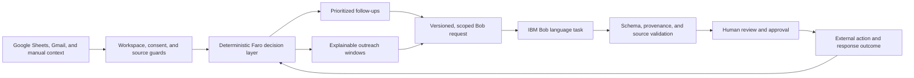

# Faro Analytics

<p align="center">
  
</p>

<p align="center"><strong>Know who needs you next, why now, and what context is safe to use.</strong></p>

<p align="center">
  <a href="#problem-statement">Problem</a> ·
  <a href="#solution-description">Solution</a> ·
  <a href="#current-sponsorship-impact">Impact</a> ·
  <a href="#product-demo-the-sponsorship-pipeline">Product demo</a> ·
  <a href="#ai-approach-and-architecture">Architecture</a> ·
  <a href="#how-ibm-bob-was-used">IBM Bob</a> ·
  <a href="#run-faro-locally">Run locally</a>
</p>

Faro Analytics is a governed relationship-intelligence workspace for partnership, sponsorship,
fundraising, program, and community teams. It turns fragmented relationship data into a required
future action, explains the timing behind that recommendation, and keeps every AI-assisted draft
under human review.

The name comes from the Spanish word _faro_, “lighthouse.” The product is designed to feel like a
calm signal in a noisy workflow: enough context to make the next decision without turning
relationships into a wall of activity metrics.

<p align="center">
  
</p>

> Faro uses Carbon and an IBM-inspired visual language. It is not an official IBM product and does
> not use the IBM corporate logo.

## Problem statement

Relationship-driven teams rarely lack data; they lack a trustworthy way to act on it. Sponsorship,
partnership, fundraising, and community outreach context is fragmented across spreadsheets,
inboxes, campaign notes, and individual memory. Teams must manually reconstruct who needs a
response, what was promised, when to follow up, and which facts are safe to use. The result is
missed opportunities, duplicated outreach, generic messages, and no clear evidence trail.

Text generation alone does not solve that problem. An unconstrained AI assistant can produce more
copy while still ignoring consent, quiet hours, recipient time zones, campaign scope, source
provenance, or workspace boundaries. Teams need a decision and evidence layer that identifies the
next action, explains why it matters now, and keeps a person accountable for the final
communication.

## Solution description

Faro Analytics brings governed relationship context into one workspace, calculates the next action
with deterministic rules, and uses IBM Bob only for bounded language work. Every recommendation
keeps its timing evidence, approved source records, consent state, provenance, and human-review
status visible.

- **Who needs attention?** A prioritized relationship queue combines due work, campaign context,
  prior responses, consent, and business value.
- **Why now?** Deterministic outreach windows expose reason codes, confidence, data sufficiency,
  quiet-hour checks, and recipient-local time.
- **What should happen next?** Faro keeps the recommended action, approved facts, and relevant
  history together before a draft is requested.
- **What can be trusted?** Source freshness, draft provenance, workspace scope, suppression, and
  human approval remain visible throughout the workflow.

Faro is a decision and evidence layer, not an autonomous sender. It does not invent contact facts,
silently switch AI providers, or send external outreach on a model’s behalf.

## Selected challenge theme

**AI for productivity: responsible automation for relationship-driven teams.**

Faro reduces the time teams spend reconstructing context and deciding what to do next, while
preserving the controls required for real outreach. The productivity gain comes from consolidating
evidence, prioritizing work, calculating safe timing, and preparing a reviewable draft. It does not
come from removing the person who owns the relationship.

## Current sponsorship impact

Faro turns the sponsorship pipeline into a measurable campaign. Confirmed cash, in-kind support,
and high-interest relationships remain separate so the dashboard never overstates money raised.

| Campaign signal              |                    Current state | How Faro treats it                                                |
| ---------------------------- | -------------------------------: | ----------------------------------------------------------------- |
| Confirmed cash from jolli.ai |                       **$1,000** | Counts toward money raised                                        |
| Annual cash target           |                      **$43,000** | Matches the recorded cash baseline from past sponsors             |
| Cash still to raise          |                      **$42,000** | Remains visible as the campaign gap                               |
| Tavily support               |  **Approximately 8,000 credits** | Tracked as in-kind support, not cash                              |
| Meta relationship            |                **High interest** | Tracked as a lead, not a confirmed sponsor                        |
| Meta planning action         | **Start in early November 2026** | Begins 2027 sponsor talks before the requested December follow-up |

**2026 cash goal progress**

```text
$1,000 raised / $43,000 goal
[█░░░░░░░░░░░░░░░░░░░] 2.3%
```

> **Data provenance:** The sponsor statuses above were supplied as workspace updates on July 30, 2026. Faro preserves the stated status and does not independently verify external commitments.
> Tavily credits and Meta interest do not contribute to the cash total.

## The relationship decision loop

1. **Bring governed context together.** Import selected Google Sheets data, connect bounded Gmail
   history, or enter approved workspace context.
2. **Find the next relationship action.** Faro ranks follow-ups and calculates explainable,
   recipient-local outreach windows.
3. **Prepare from approved facts.** IBM Bob receives a versioned request with minimized context and
   an explicit source allowlist.
4. **Review before anything leaves Faro.** A person checks the subject, message, rationale,
   confidence, and risk flags.
5. **Learn from outcomes.** Responses, accepted recommendations, campaign movement, and sync health
   return as operational signals.

The same governed loop applies to sponsorship, nonprofit fundraising, university partnerships,
business development, customer success, and other relationship-driven work.

## Product demo: the sponsorship pipeline

These screenshots come from the running fictional product-tour workspace. They show implemented
features, not generated mockups. The current sponsorship impact above is a separate,
workspace-supplied portfolio snapshot.

<details open>
<summary><strong>1. Import and validate the sponsor pipeline</strong></summary>

<br />



**Sponsorship connection:** Faro maps sponsor records into canonical contact and organization
fields, flags invalid rows, detects existing contacts, and previews every change before import.
This prevents a malformed spreadsheet row from silently becoming outreach context.

</details>

<details open>
<summary><strong>2. See funding, priority, timing, and pipeline movement together</strong></summary>

<br />



**Sponsorship connection:** The dashboard places the next sponsor action ahead of aggregate
metrics. Teams can review the campaign queue, estimated pipeline value, recommended timing, source
freshness, and IBM Bob request state without losing the relationship context behind each number.

</details>

<details open>
<summary><strong>3. Review sponsor follow-ups before outreach</strong></summary>

<br />



**Sponsorship connection:** A follow-up keeps the sponsor request, initial date, due date, latest
response, recommended action, timing evidence, draft provenance, and risk flags in one review
surface. A person can edit and approve the draft, but generation never sends it.

</details>

<details open>
<summary><strong>4. Measure the real outcome of sponsorship outreach</strong></summary>

<br />



**Sponsorship connection:** Analytics shows whether outreach creates responses, positive signals,
meetings, and committed relationships. Campaign and channel comparisons help the team improve the
next sponsorship cycle without presenting modeled projections as recorded outcomes.

</details>

## Real-world impact

Faro is designed to improve the quality and accountability of sponsor operations. The project does
not claim unmeasured time savings or revenue attribution. Its implemented impact is visible in the
workflow:

| Common sponsorship failure                                 | Faro response                                                    | Practical impact                               |
| ---------------------------------------------------------- | ---------------------------------------------------------------- | ---------------------------------------------- |
| Sponsor details are split across Sheets, email, and memory | Bring selected records into one workspace with source freshness  | Less context reconstruction before a follow-up |
| Cash, credits, and interest are mixed together             | Track each contribution type separately                          | More truthful fundraising totals               |
| High-value follow-ups are missed                           | Require a future action and surface the earliest priority        | Clear ownership of the next step               |
| Timing is guessed                                          | Calculate recipient-local windows with reason codes              | Reproducible outreach timing                   |
| AI invents or overreaches                                  | Minimize context, validate sources, and reject malformed output  | Safer draft assistance                         |
| Drafting and sending are treated as one action             | Separate generation, editing, approval, and delivery             | Human control over sponsor communication       |
| Teams cannot tell what converted                           | Track responses, meetings, commitments, and campaign performance | A measurable feedback loop for the next event  |

## AI approach and architecture

Faro uses a hybrid architecture: deterministic software makes operational and safety decisions,
while IBM Bob performs the language task inside a narrow, validated boundary. This keeps
prioritization and scheduling reproducible instead of asking a model to guess whom to contact or
when.



| Layer            | Responsibility                                                             | Implementation                                                                                      |
| ---------------- | -------------------------------------------------------------------------- | --------------------------------------------------------------------------------------------------- |
| Governed context | Import only selected records and treat all external text as untrusted data | Google Sheets and Gmail adapters, Zod validation, PostgreSQL/Prisma                                 |
| Decision layer   | Rank follow-ups and calculate future recipient-local windows               | Versioned deterministic optimizer with quiet-hour, frequency, consent, and suppression guards       |
| AI boundary      | Prepare language from minimized, approved context                          | Versioned contracts and prompts in `packages/ibm-bob`; scoped retrieval and writes through Faro MCP |
| Validation       | Reject unsupported sources, malformed output, and unsafe states            | Strict output schemas, approved source IDs, provenance checks, workspace authorization              |
| Human control    | Review and edit before any communication leaves Faro                       | Separate generation, review, approval, and delivery states                                          |

Google Sheets, Gmail, and manual workspace input provide bounded context. Faro owns authorization,
consent, suppression, workspace isolation, deterministic timing, request state, validation, and
audit history. IBM Bob handles only the language task inside that boundary. A person owns approval
and any external delivery.

For deeper implementation detail, use the
[architecture decisions](docs/architecture/DECISIONS.md), [AI boundary](docs/AI_BOUNDARY.md), and
[security notes](docs/SECURITY.md).

## Product principles

- **Decision first:** surface the relationship and action before aggregate charts.
- **Explainability over prediction theater:** timing recommendations are deterministic,
  reproducible, and inspectable.
- **Context minimization:** imported fields and message bodies are untrusted data, never prompt
  instructions.
- **Human agency:** drafts require review; approval and delivery are distinct actions.
- **Truthful states:** demo, awaiting, configured, failed, preview, and delivered are never
  presented as equivalent.
- **Workspace isolation:** every tenant-owned database and MCP operation is scoped by workspace.
- **Explicit follow-up dates:** every task stores when the need began and when the follow-up is due;
  the database rejects an initial date later than its follow-up date.
- **A future action for every contact:** every contact stores a required next-action type and UTC
  instant. Prior outbound activity produces a follow-up; otherwise eligible contacts receive an
  initial outreach. Expired optimizer deadlines are recalculated instead of displayed as overdue.
- **Required internal SMS:** every due follow-up enters the SMS reminder path once its assignee has
  verified and consented to a mobile number. Priority filters never suppress SMS.
- **No silent AI fallback:** IBM Bob is Faro’s only runtime AI integration.

## Run Faro locally

### Prerequisites

- Node.js 22+
- pnpm 10.29.3 through Corepack
- Docker for PostgreSQL-backed and connected workspace flows

### Install

```bash
corepack enable
pnpm install
cp .env.example .env
```

Never commit `.env`, OAuth tokens, API keys, or production personal data.

### Start the application shell

```bash
pnpm dev
```

Open <http://localhost:3000/dashboard>.

Without a verified session, Faro opens an honest empty workspace and asks the user to connect
Google. `FARO_DATA_SOURCE` selects the repository adapter; it does not bypass the browser’s session
boundary or expose fictional contacts automatically.

### Start a connected workspace

Configure `DATABASE_URL`, session secrets, Google OAuth values, token encryption, and allowed
tester emails in the ignored `.env`, then run:

```bash
docker compose up -d postgres redis
docker compose ps
pnpm db:generate
pnpm db:deploy
pnpm dev
```

Wait until PostgreSQL and Redis report healthy before deploying migrations. Use one hostname
consistently across the browser, `APP_URL`, and Google OAuth redirect URI.

Run the recurring Sheet and notification scheduler in a second terminal when either cron secret is
configured:

```bash
pnpm worker
```

Faro has three explicit browser states:

- **Empty:** no verified session and no fictional records.
- **Connected:** a Google-authenticated, database-backed workspace with isolated data.
- **Fallback demo:** fictional, labeled records shown only after an OAuth callback failure; they
  are never mixed into a connected workspace.

Read [Deployment and integrations](docs/DEPLOYMENT_INTEGRATIONS.md) for Google Console setup,
tester access, secret generation, and deployment preflight.

## How IBM Bob was used

IBM Bob is Faro’s only runtime AI provider. It is used to turn already-approved relationship facts
into a structured outreach draft; it is not used to choose the recipient, calculate the outreach
window, override consent, approve a message, or send external communication.

The implemented workflow is:

1. A user reviews a contact, campaign, follow-up reason, and deterministic timing recommendation.
2. Faro validates consent and suppression, minimizes the context, and creates an idempotent
   `AWAITING_BOB` request with a versioned prompt and an allowlist of source-record IDs.
3. IBM Bob claims the request through Faro MCP, or the explicitly configured local Bob Shell
   processes the same governed prompt.
4. Bob returns strict JSON containing a subject, plain-text body, rationale, recommended next
   action, optional follow-up time, confidence, risk flags, and cited source-record IDs.
5. Faro rejects malformed output or unapproved citations, records provenance and audit state, and
   presents the result for human editing and approval. Generation never triggers delivery.

Faro supports two IBM Bob execution paths:

1. **MCP-first:** Faro persists an `AWAITING_BOB` request. Bob claims it through the scoped Faro MCP
   server, reads only approved context, and saves validated structured output.
2. **Local Bob Shell:** an explicitly configured local `bob` process completes the same governed
   request from the web server.

Both paths use the same versioned prompt contracts, source allowlists, workspace checks, output
schema, provenance, audit trail, and mandatory human review. No path sends the resulting message.

Only a real authenticated Bob operation may be labeled **Generated by IBM Bob**. Static fixtures
remain **Demo draft**, and requests stay **Awaiting IBM Bob** when no verified runtime is available.
Faro never substitutes another model provider.

If local automation returns `BOB_SHELL_FAILED`, Bob Shell exited non-zero. A suspended plan,
invalid/expired key, exhausted entitlement, or local CLI failure can all stop generation before
Faro receives a draft. Use
[Bob Shell troubleshooting](docs/IBM_BOB_WORKFLOW.md#troubleshoot-local-bob-shell) rather than
assuming the prompt failed.

## Google Sheets, Gmail, and notifications

- **Google Sheets:** connected workspaces can save multiple bounded Sheet connections, validate
  mappings, import canonical records, monitor polling, and write explicit mapped contact edits back
  to their source row.
- **Gmail:** Faro reads bounded history with `gmail.readonly` and associates matched messages with
  existing contacts. It does not send, delete, label, or archive mail.
- **Notifications:** internal reminders remain distinct from external outreach. Preview is the
  default adapter. With Twilio configured, every due follow-up sends a deduplicated SMS to its
  verified, consenting internal assignee; it never texts the external contact.

See [Google Sheets](docs/GOOGLE_SHEETS.md),
[deployment and integrations](docs/DEPLOYMENT_INTEGRATIONS.md), and
[notifications](docs/NOTIFICATIONS.md). The scheduling state machine and reset behavior are
documented in [Contact scheduling](docs/CONTACT_SCHEDULING.md).

The complete Twilio, worker, phone-verification, and smoke-test sequence is in
[Start required follow-up SMS](docs/NOTIFICATIONS.md#start-required-follow-up-sms).

## Repository map

```text
apps/
  web/                    Next.js product UI and validated route handlers
  worker/                 Follow-up and notification job runner
packages/
  core/                   Domain contracts, workspace guards, demo data
  database/               Prisma schema, migrations, client, fictional seed
  optimizer/              Deterministic outreach-window scoring
  ibm-bob/                Only permitted runtime AI boundary
  faro-mcp/               Governed IBM Bob and Faro MCP tools
  google-sheets/          Mapping, preview, validation, sync, write protection
  google-sheets-mcp/      Scoped Sheets MCP tools
  notifications/          Provider contracts, scheduling, dedupe, adapters
docs/                     Architecture, integration, security, screenshots, assets
scripts/                  Boundary, documentation, and screenshot checks
tests/                    Cross-package integration and browser flows
```

## Verification

Run commands from the repository root:

```bash
pnpm format:check
pnpm lint
pnpm typecheck
pnpm test
pnpm test:integration
pnpm test:database
pnpm docs:check
pnpm check:ai-boundary
pnpm build
pnpm test:e2e
```

The product preserves semantic HTML, keyboard behavior, visible focus, text-plus-icon status,
textual chart summaries, responsive reflow, reduced motion, and forced-color considerations.
Manual screen-reader, zoom, contrast, and mobile review remain release requirements.

## Project assets

- [100 × 100 Faro Analytics project logo](docs/assets/faro-project-logo.png)
- [Wide dashboard background](docs/assets/faro-dashboard-background.png)
- [Dimensions, provenance, and validation](docs/PROJECT_ASSETS.md)

The dashboard background is promotional project-cover artwork. Use the Playwright captures under
`docs/screenshots/` when a submission requires evidence of the running product.

## Documentation

- [Architecture decisions](docs/architecture/DECISIONS.md)
- [AI boundary](docs/AI_BOUNDARY.md)
- [Campaign associations and analytics](docs/CAMPAIGN_ANALYTICS.md)
- [Contact scheduling and expired-date reset](docs/CONTACT_SCHEDULING.md)
- [Deployment and integration setup](docs/DEPLOYMENT_INTEGRATIONS.md)
- [IBM Bob and Faro MCP workflow](docs/IBM_BOB_WORKFLOW.md)
- [Google Sheets synchronization](docs/GOOGLE_SHEETS.md)
- [Notification delivery](docs/NOTIFICATIONS.md)
- [Security and privacy](docs/SECURITY.md)
- [Accessibility](docs/ACCESSIBILITY.md)
- [Project image assets](docs/PROJECT_ASSETS.md)

`AGENTS.md` contains the durable engineering conventions for contributors and coding agents.

## License

[MIT](LICENSE)

Faro is available under the [MIT License](LICENSE). Carbon packages and IBM Plex fonts retain their
respective upstream licenses. “IBM” and “IBM Bob” are trademarks of their respective owner; this
project makes no claim of endorsement.
